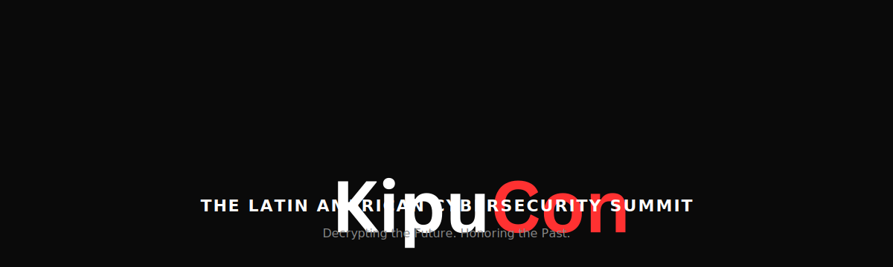

---

## Talks

<table width="100%">
<tr>
<td width="50%" valign="top">

### 🌐 Lo que un hacker ve y tu empresa no

**Omri Nuri** — Web Red Team Lead, Sec-Llama

Four real vulnerabilities that exposed millions of Latin American records — demonstrated live. IDOR, broken auth, Base64 theater, and automated exploitation. Built for C-level decision makers.

→ [Slides + Demo](./lo-que-un-hacker-ve/)

</td>
<td width="50%" valign="top">

### 🏗️ When Elevators Get Hacked

**Michael Dahan** — Sec-Llama

A live simulation of a targeted OT/ICS attack against a building's elevator control system. PLCs, a SCADA dispatcher, Modbus TCP, and a real-time dashboard — all on your laptop.

→ [Slides + Demo](./when-elevators-get-hacked/)

</td>
</tr>
</table>

---

[kipucon.org](https://kipucon.org) &nbsp;·&nbsp; Lima, Peru &nbsp;·&nbsp; 2026

